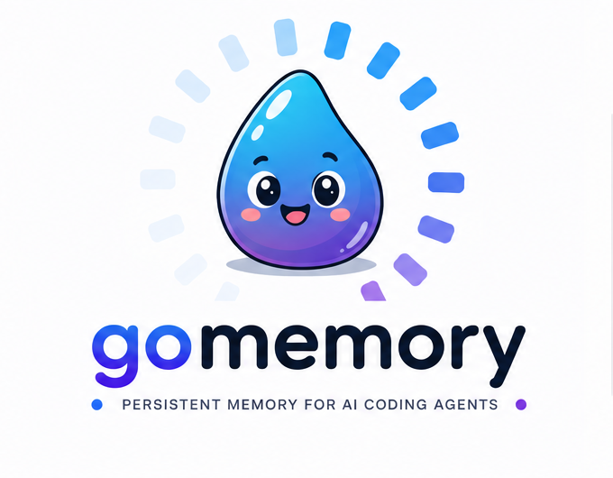

<p align="center">
  
</p>

<p align="center">
  <strong>Persistent, local and portable memory for AI coding agents</strong>
</p>

[](https://github.com/Sayoner-000/gomemory/releases/latest)
[](https://go.dev/)
[](LICENSE)
[](https://modelcontextprotocol.io/)
[](https://github.com/charmbracelet/bubbletea)

gomemory gives AI coding agents persistent memory across sessions.
It stores project context, architectural decisions, bug fixes, learnings and checkpoints in a local SQLite database — so your agent can remember what happened, why it happened, and what was decided without polluting your repository with memory files.

Works with Claude Code, Cursor, OpenCode, Windsurf, Cline and Codex through the [Model Context Protocol](https://modelcontextprotocol.io/) (MCP).

```
┌──────────────────────────────────────────────┐
│              AI Coding Agent                 │
│                                              │
│ Claude Code · Cursor · OpenCode · Codex      │
│ Windsurf · Cline                             │
└──────────────────────┬───────────────────────┘
                       │ MCP
                       ▼
┌──────────────────────────────────────────────┐
│                  gomemory                    │
│                                              │
│  Context · Decisions · Bugfixes · Learning   │
│  Checkpoints · Architecture · Patterns       │
└──────────────────────┬───────────────────────┘
                       │
                       ▼
              ┌─────────────────┐
              │ Local SQLite DB │
              │   Persistent    │
              │    Portable     │
              └─────────────────┘
```

No cloud service. No API key. No database server. No files added to your project.

## Why gomemory?

AI coding agents are powerful, but their context is often temporary.
When a session ends, important information can disappear:

- Why was this architecture chosen?
- What bug was fixed and how?
- Which approach was rejected?
- What did we learn from the previous implementation?
- What decisions should the next session know about?

gomemory turns that temporary context into persistent project memory.

## Quick Start

### 1. Install

**Linux / macOS:**
```bash
curl -fsSL https://raw.githubusercontent.com/Sayoner-000/gomemory/main/scripts/install.sh | bash
```

**Windows (PowerShell):**
```powershell
irm https://raw.githubusercontent.com/Sayoner-000/gomemory/main/scripts/install.ps1 | iex
```

Verify:
```bash
mem --help
```

### 2. Connect your coding agent

**For agents with global MCP configuration:**
```bash
mem setup-mcp --scope global --agents claude,codex,opencode
```

**For project-scoped configuration:**
```bash
cd /path/to/your/project
mem setup-mcp --scope project --agents cursor,windsurf,cline --target .
```

That's it. Your memory is stored outside the repository:

- **Linux / macOS:** `~/.local/share/gomemory/`
- **Windows:** `%LOCALAPPDATA%\gomemory\`

> **`mem setup-mcp` vs `mem setup`:** `setup-mcp` registers the **MCP tools** for all 6 supported agents. The **auto-checkpoints** and **plan capture** features additionally require the hooks/plugin from `mem setup <agent>`, currently available for `opencode` and `claude-code`. In Cursor/Windsurf/Cline/Codex you get memory via MCP, but without that automatic per-turn capture.

### 3. Try it

```bash
# Save a decision
mem save -t "API routing" -y decision "Use Fiber for HTTP routing"

# Search your project memory
mem search "API routing"

# View recent memories
mem list

# Get the current project context
mem context

# Open the interactive terminal UI
mem
```

## What it remembers

gomemory supports structured memory instead of treating everything as an undifferentiated text dump.

| Type | Purpose |
| :--- | :--- |
| `architecture` | Architectural decisions and structure |
| `decision` | Important technical decisions |
| `bugfix` | Bugs, causes and solutions |
| `pattern` | Reusable implementation patterns |
| `learning` | Lessons learned |
| `discovery` | Findings and investigations |
| `preference` | User/project preferences |
| `checkpoint` | Session progress |

## Key Features

**Persistent memory**
Memory survives agent sessions and is stored locally in SQLite.

**Relevant retrieval**
Memory search uses FTS5 + BM25 ranking, with an automatic LIKE fallback when FTS5 is unavailable.

**Connected memory**
Related memories are automatically linked through synapses, forming a persistent knowledge graph that is re-injected into each `get_context`.

**Context-aware retrieval**
`get_context` is budget-limited and `get_memory` provides full details on demand — minimizing token usage.

**Privacy by design**
Memory stays local. Sensitive information is automatically redacted (AWS credentials, GitHub tokens, AI provider keys, Slack tokens, JWTs, PEM private keys). You can also explicitly mark content as private:

```
<private>This information should never be persisted.</private>
```

**Interactive TUI**
Full terminal UI built with [bubbletea v2](https://github.com/charmbracelet/bubbletea) — navigate memories, view token usage reports (`u` key), and manage settings with a Matrix-inspired color palette.

**Automatic checkpoints**
With Claude Code and OpenCode, active turns are captured automatically as checkpoints without consuming additional agent tokens.

**Plan memory**
Agents can retrieve project history and atomic decomposition guidance before planning:

```bash
mem plan-context
```

**Code graph integration**
Optional integration with an external code graph (via [`codebase-memory-mcp`](https://github.com/DeusData/codebase-memory-mcp)) enriches memory with modules, symbols, dependencies, hotspots and callers. Non-blocking and agnostic to the agent. Controlled via `mem settings --code-graph=true|false`.

**ADR synchronization**
Architecture and decision memories can optionally synchronize with external ADR documents. Controlled via `mem settings --adr-sync=true|false`.

**Portable memory**
Export project memory as a self-contained JSON bundle:

```bash
mem export    # → project-memory.json
mem import    # → import with dedup, preserving timestamps and relationships
```

**Automatic backups**
Local snapshots are created at session end. Do not synchronize `mem.db` directly — SQLite uses WAL mode and partial synchronization can corrupt the database. Use the exported JSON backup instead.

**Measured token usage**
`mem usage` reports how many tokens a session's emissions actually cost versus what they would have cost unoptimized — baseline, emitted, and the saved delta, broken down by operation and by channel (MCP, CLI, TUI). Figures are measured with a neutral approximate counter, comparable against themselves (before/after, percentages), never against any provider's billing. An optional reference-window setting (off by default) adds an estimated "footprint avoided" percentage, clearly labeled as an estimate. The same report is available from the interactive UI (`u` key), alongside an on-demand context-optimization snapshot for a specific task. See [`docs/USAGE-REPORT-CONTRACT.md`](docs/USAGE-REPORT-CONTRACT.md) for the machine-readable contract (`mem usage --json`).

## MCP Tools

19 tools across three groups (`domain/mcp_tools.go` is the single source of truth).

**Memory (10)**

| Tool | Description |
| :--- | :--- |
| `save_memory` | Store structured project memory |
| `search_memories` | Search relevant memories |
| `list_memories` | List recent memories |
| `get_memory` | Retrieve a complete memory |
| `get_context` | Retrieve project context |
| `get_plan_context` | Retrieve planning context |
| `start_session` | Start a working session |
| `end_session` | Close a working session |
| `forget_memory` | Remove a memory |
| `judge_memories` | Resolve conflicting memories |

**Code graph (5)** — gomemory's own Go symbol graph, no external dependency

| Tool | Description |
| :--- | :--- |
| `index_project` | Index (or re-index) the project's Go code into the symbol graph |
| `graph_status` | Show indexed graph size: files, symbols, relationships, top packages |
| `search_code` | Search code symbols by name, signature, or package |
| `get_symbol` | Get a symbol's definition plus its direct callers/callees |
| `list_dependencies` | Walk a symbol's dependency graph (calls or imports) up to a given depth |

**Context Optimization Engine (4)** — `mem pack`, builds a token-budgeted `ContextPack`

| Tool | Description |
| :--- | :--- |
| `pack_build` | Build a `ContextPack`: retrieve, dedupe, prioritize, compress, and fit a token budget |
| `pack_show` | Re-render an already-built `ContextPack` as readable Markdown |
| `pack_stats` | Return only the reduction-stats block of an already-built `ContextPack` |
| `pack_compress` | Deterministically compress arbitrary text (no retrieval/budget), report token cost |

**Resources:** `mem://context` · `mem://memory/{id}`

## CLI

```
mem
├── save              Save a memory manually
├── capture           Guided memory form (What/Why/Where/Learned)
├── search            Search project memory
├── list / log        List recent memories
├── forget            Delete a memory by ID
├── compare / judge   Record a verdict between two memories, or list verdicts
├── context           Show current context (get_context)
├── plan-context      Atomic planning context (for plan mode)
├── pack build        Build a token-budgeted ContextPack for a task
├── pack show         Re-render an already-built ContextPack
├── pack stats        Reduction stats of an already-built ContextPack
├── pack compress     Deterministic compression of arbitrary text
├── project           Show current project info
├── index             Index the project's Go code graph (+ external graph, --skip-graph to opt out)
├── session start/end Open/close a working session
├── export / import   Portable JSON bundle (backup/restore, cross-machine)
├── docs              Pinned docs: list | show | export | import | reset
│                     Work rules and constitution live in memory, not in repo files.
│                     Ships defaults, not doctrine — swap in your team's own.
├── constitution      Show the project's current constitution (--sync writes spec-kit's file)
├── rules             Show the project's current work rules
├── purge / gc         Delete memories / retention-based cleanup
├── consolidate        Merge redundant memories (shared topic key + duplicate activity logs)
├── get <id>           Retrieve a memory's full detail by ID
├── usage              Measured token benchmark: baseline/emitted/saved per session (--json, --all)
├── compact           Reclaim SQLite space (no data loss)
├── adr-sync status   Inspect ADR sync state with the external code-graph provider
├── install           Install gomemory into a project (no instruction files are generated)
├── setup <agent>     Install the hooks/plugin for opencode | claude-code
├── setup-mcp         Register MCP tools for all 6 supported agents
├── uninstall         Fully remove gomemory from a project
├── settings          View/change auto-approve and other toggles
├── doctor            Coverage report of atomic plan mode channels (--json, --strict)
├── update            Update the binary
├── mcp               Run the MCP server over stdio
├── hook <event>      Agent hook entrypoint (internal, invoked by Claude Code/OpenCode)
├── wrap <cmd>        Run a command, then prompt to save a memory about it
├── tui               Open the interactive terminal UI explicitly
└── help              Show help
```

Run `mem help` for the complete command reference.

## Architecture

```
gomemory/
├── domain/          # Core domain models and rules
├── application/     # Use cases and application services
├── adapters/        # CLI, MCP, TUI and SQLite adapters
├── infrastructure/  # Agent integrations and orchestration
├── scripts/         # Installation scripts
├── tests/           # Tests
└── docs/            # Extended documentation
```

**Storage:** SQLite embedded via `modernc.org/sqlite` (no CGO required). Lives in a global user store, not inside your repository.

**MCP transport:** `stdio` + JSON-RPC. The agent launches `mem mcp` as a subprocess. No TCP server or exposed network port.

**Code graph:** Provider-based architecture (`CodeGraphProvider` port in hexagonal style) allows integrating external code graphs without coupling the core. Hot path reads a cached snapshot; background refresh never blocks saves or context.

For the complete architecture, see [`docs/architecture.md`](docs/architecture.md).

## Configuration

Main settings (via `mem settings` or the interactive TUI):

| Setting | Default | Description |
| :--- | :--- | :--- |
| `budget` | `24000` | Max characters returned by `get_context` |
| `compact_threshold` | `48000` | Context size that triggers compaction guidance |
| `dedup_window_days` | `7` | Deduplication window |
| `synapse_disabled` | `false` | Disable automatic memory relationships |
| `atomic_plan_disabled` | `false` | Disable atomic planning |
| `plan_guard_disabled` | `false` | Disable the deterministic plan-shape guard (`mem hook plan-guard`) — see [`docs/AGENT-INTEGRATION.md`](docs/AGENT-INTEGRATION.md) |
| `code_graph_disabled` | `false` | Disable the optional external code-graph provider entirely |
| `code_graph_providers` | *(none)* | Ordered list of external code-graph provider commands (priority fallback) |
| `code_impact_annotation_disabled` | `false` | Disable annotating saved memories with code-graph hotspot impact |
| `adr_sync_enabled` | `false` | Opt-in bidirectional sync of architecture memories with the external provider's ADR document |

See [`docs/MEMORY-PROTOCOL.md`](docs/MEMORY-PROTOCOL.md) for all configuration options.

## Build from Source

Requirements: Go 1.25+

```bash
git clone https://github.com/Sayoner-000/gomemory.git
cd gomemory
go build -o mem ./infrastructure/
./mem install .
```

Run tests:
```bash
go test ./...
```

## Supported Agents

| Agent | MCP | Automatic hooks |
| :--- | :---: | :---: |
| Claude Code | ✅ | ✅ |
| OpenCode | ✅ | ✅ |
| Cursor | ✅ | — |
| Windsurf | ✅ | — |
| Cline | ✅ | — |
| Codex | ✅ | — |

MCP provides persistent memory across all supported agents. Automatic checkpoint and plan capture currently depend on the agent integration.

## Security & Privacy

gomemory is designed as a local-first memory system.
By default:

- Data remains on your machine
- No external database is required
- No network service is opened
- Sensitive credential patterns are redacted
- Database permissions are restricted
- Memory can be exported or deleted by the user

For security details and limitations, see [`docs/MANUAL.md`](docs/MANUAL.md).

## Documentation

| Document | Description |
| :--- | :--- |
| [`docs/MANUAL.md`](docs/MANUAL.md) | Complete user guide: multi-agent, troubleshooting, security, portability |
| [`docs/architecture.md`](docs/architecture.md) | Internal architecture deep dive |
| [`docs/MEMORY-PROTOCOL.md`](docs/MEMORY-PROTOCOL.md) | Memory protocol technical reference |
| [`docs/AGENT-INTEGRATION.md`](docs/AGENT-INTEGRATION.md) | Agent-agnostic contract for the atomic plan mode — implement it for any agent gomemory doesn't know yet |
| [`CONTRIBUTING.md`](CONTRIBUTING.md) | How to contribute |
| [`CODE_OF_CONDUCT.md`](CODE_OF_CONDUCT.md) | Community guidelines |

## Contributing

Contributions are welcome. Before opening a pull request:

```bash
go test ./...
go vet ./...
```

Please read [`CONTRIBUTING.md`](CONTRIBUTING.md) and [`CODE_OF_CONDUCT.md`](CODE_OF_CONDUCT.md).

If you find a bug or have an idea, [open an issue](https://github.com/Sayoner-000/gomemory/issues) with enough context to reproduce or evaluate it.

## Roadmap

The project is actively evolving. Areas of interest include:

- Additional coding-agent integrations
- Improved memory ranking and retrieval
- More code-graph providers
- Better visualization of memory relationships
- Performance improvements
- Additional portability and synchronization options

See [GitHub Issues](https://github.com/Sayoner-000/gomemory/issues) for current work.

---

**Author:** Sayoner ([@Sayoner-000](https://github.com/Sayoner-000))
**License:** MIT · See [`LICENSE`](LICENSE)

*Built with Go, SQLite and the [Model Context Protocol](https://modelcontextprotocol.io/).*

If gomemory is useful to you, consider giving the project a ⭐ on GitHub.
